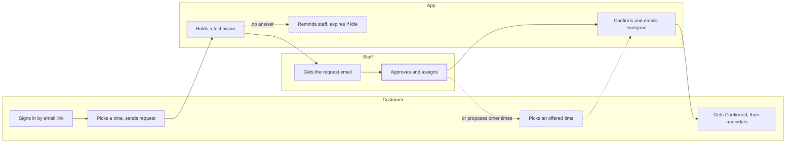
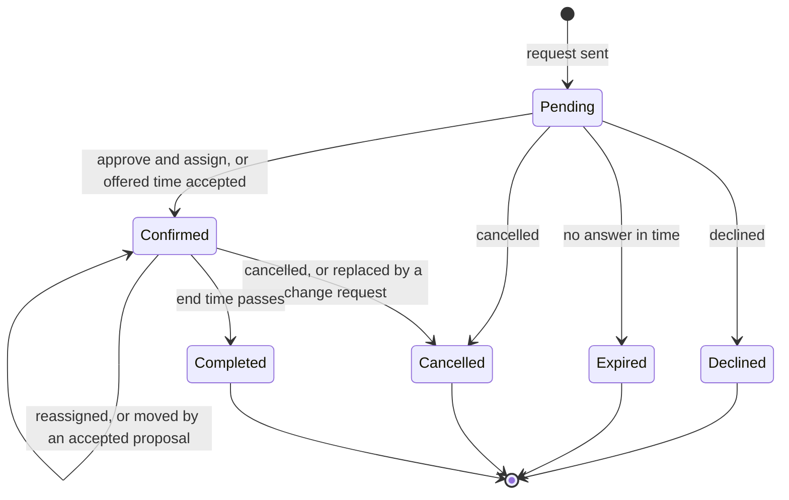
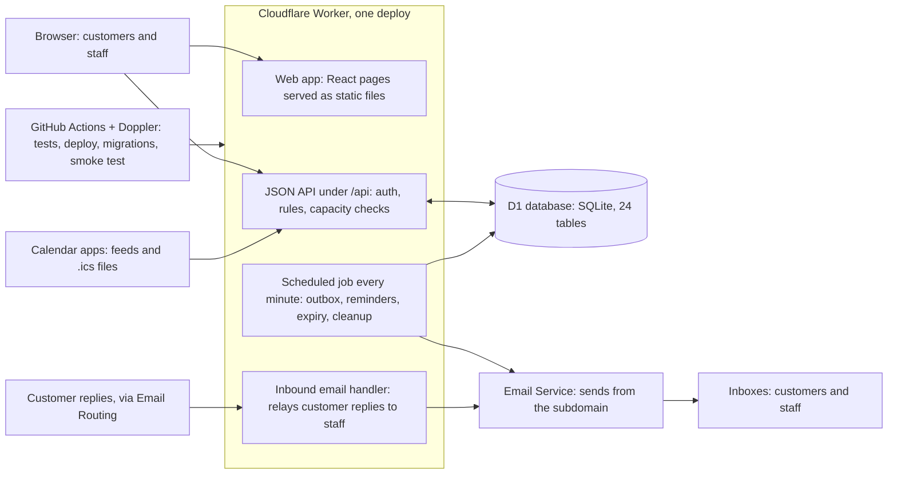

# Remote Support Booking — Product & Technical Specification

Last updated: 2026-10-05. Diagrams are Mermaid (rendered on GitHub).

## About this document

This is the specification for building the production version of Remote Support Booking. It describes what a working proof of concept (PoC) already does, so a development team can rebuild it to production standards on the platform of its choice.

- **Source of truth:** every requirement here is taken from the PoC as deployed on 2026-10-05: its code, tests and setup guide. The PoC is open source and can be run locally to see any behaviour described.
- **Priorities:** Must, Should and Could mark what the first production release needs. The PoC implements all of it unless a requirement says otherwise.
- **Technology:** the PoC stack is listed in Architecture, configuration and deployment. It is a reference, not a requirement; the business rules and user experience are what must carry over.
- **Open points:** questions the business still has to answer are collected at the end, under Lessons from the PoC.

## Product overview

Remote Support Booking lets a technical-service team's registered customers request a remote support session online. A person on the team approves each request and assigns a technician, and everything after that happens by email. The session itself is a phone call plus a remote-access tool (TeamViewer, AnyDesk or similar), which the app neither stores nor brokers.

**Problem.** Today, sessions are arranged by phone and email. Requests get lost, two customers can be promised the same technician, and nobody sees the team's week at a glance.

**Who it is for.** Small service teams (IT support, equipment vendors and similar) that:

- support a known list of customer organisations, not the general public
- want a person to approve every appointment, not instant self-service booking
- have a few technicians whose working hours and capacity must be respected

**Goals and success criteria**

| Goal | Measure of success |
| --- | --- |
| Customers book without phoning | A registered contact can request a time on a phone, unaided, in three steps (time, details, review) |
| No double booking | A technician can never hold two overlapping appointments, buffers included, even under simultaneous requests |
| No request falls through | Every request is approved, declined or expired automatically, with staff reminded before it expires |
| The team sees its workload | Week and month calendars show every booking by technician |
| Changes are traceable | Every state change is in an audit log with who did it and when |

**In scope:** magic-link sign-in for registered customer contacts; slot booking with technician-aware capacity; staff approval and assignment; rescheduling proposals; cancellation; reminders; staff scheduling (working hours, exceptions, time off); customer administration with CSV import; staff management; settings; audit log; email outbox with retries; replies relayed to the team; calendar links and staff calendar subscriptions; English UI with a translation catalog.

**Out of scope:** payments, subscriptions, AI features, CRM features, remote-access tool integrations, video or meeting links, Outlook/Microsoft Graph integration, customer calendar subscriptions, public self-registration, and storing any remote-access credentials.

## Roles and terminology

There are two kinds of users: customer contacts, who request sessions, and staff, who are administrators or technicians. Customers never register themselves; staff add them.

| Term | Meaning |
| --- | --- |
| Customer | An organisation (or person) the team supports, with a customer number. Also called an account. |
| Contact | A person who may book for a customer, identified by email address. A customer can have up to 50 contacts; one email can be a contact for several customers. |
| Staff member | A team member who signs in to the staff area. Role: administrator or technician. |
| Bookable | A staff member who can be assigned sessions. Administrators can be bookable too. |
| Reservation | One requested or agreed session, with a reference such as R-ZMWK-6J3X. |
| Request | A reservation waiting for approval (status pending). |
| Appointment | A reservation that staff approved (status confirmed), with an assigned technician. |
| Proposal | One to three alternative times offered by staff; the customer picks one. |
| Change request | A new request a customer makes to move an existing reservation; the original stands until it is approved. |
| Slot | A start time a customer can book, derived from working hours, capacity and settings. |
| Business hours | The organisation's opening hours, used for notice periods and approval deadlines. Holidays are excluded. |

**What each staff role may do**

| Action | Administrator | Technician |
| --- | --- | --- |
| See requests, the calendar, customers and the activity log | Yes | Yes |
| Approve (assigning any eligible technician, including themselves), decline, propose times, reassign, cancel | Yes | Yes |
| Subscribe to their calendar feeds | Yes | Yes |
| Edit weekly working hours and date exceptions | Yes | No |
| Record time off | Anyone's | Their own |
| Add, edit and import customers | Yes | View only |
| Manage staff, settings and holidays; pause online booking; retry failed emails | Yes | View failed emails only |

The last active administrator cannot be demoted or deactivated. The first administrator is created from a configured list of email addresses, and only while no administrator exists.

## Key user journeys

Every booking follows one path: the customer requests a time, the app holds a technician at once, and a staff member approves it. Dashed boxes and arrows are the alternatives.

1. **Book.** A registered contact signs in by email link, picks a time, enters details and sends the request. It is pending and holds a technician; the customer and the team are emailed.
2. **Approve.** A staff member opens the request from the email or dashboard, approves it and assigns a technician. The customer gets Confirmed with Add to calendar, then reminders. At the time, the technician phones the customer, who has the remote tool ready.
3. **Propose other times.** Staff offer one to three times instead. The customer picks one (confirmed at once), keeps the original time, or asks for another.
4. **Change by the customer.** Choose another time books a change request; the original stands until the change is approved.
5. **Cancel.** The customer cancels online until the cut-off; staff cancel with a reason. Both sides are emailed.
6. **No answer.** Staff are reminded, administrators alerted, and an unanswered request expires; the customer is invited to book again.
7. **Reply.** A customer's reply to any email reaches the team, who answer it directly.

## Functional requirements: customers

Customers need no password and no account setup: an emailed link signs them in, and every email about a reservation links straight to it. All customer screens are designed for phones first.

| ID | Requirement | Priority |
| --- | --- | --- |
| C-1 | **Sign in by email link.** The start page asks for an email address. The reply is always neutral ("if this address is registered, a link is on its way"), so it never reveals who is a customer. Only active contacts of active customers receive a link. | Must |
| C-2 | **Sign-in link.** Valid 15 minutes, single use. It opens a page with one Continue button, so email scanners that open links cannot use it up. An expired link offers "Send me a new link". | Must |
| C-3 | **Sign-in email for any purpose.** From the start page it offers Book a session and My reservations, each going straight there. When the destination is known (for example My reservations, or choosing another time), it shows one button that names it. | Should |
| C-4 | **Session.** 24 hours; Sign out ends it. The sign-in form remembers the last address used on the device. | Must |
| C-5 | **Account picker.** A contact of several customers chooses the account first. | Must |
| C-6 | **Choose a time.** A date strip of the booking window (default 30 days), days without times dimmed, then the free start times as large buttons. Times are shown with the time-zone label. Customers see times only, never how many technicians are free. | Must |
| C-7 | **Details.** Contact name, callback phone and the issue (up to 1,000 characters). Name and phone are prefilled from the contact record and the phone last used. | Must |
| C-8 | **Review and send.** A review card, then Send request. Re-sending the same request never creates a duplicate. If the time was taken meanwhile, the customer is told and shown fresh times, keeping the details entered. | Must |
| C-9 | **Request received.** A clear "Request received, not yet confirmed" page with the reference and what happens next. | Must |
| C-10 | **Open-request limit shown up front.** An account at its limit (default 1 open request) sees its open reservation instead of the time picker, with Choose another time and View or cancel. Below the limit, a note lists what is already open. | Must |
| C-11 | **My reservations.** Upcoming and past reservations of all the contact's accounts, with status, details and the actions allowed. | Must |
| C-12 | **Reservation link from emails.** Opens one reservation without signing in, scoped to that reservation only. Buttons in emails (cancel, answer a proposal, add to calendar) open the matching step, but nothing happens until the customer confirms. | Must |
| C-13 | **Cancel.** With an optional reason (up to 500 characters) and a confirmation step. Pending requests can be cancelled at any time; appointments until a cut-off (default 60 minutes before the start), after which the support phone number is shown instead. | Must |
| C-14 | **Answer a proposal.** Pick one of the offered times (confirmed at once), keep the original time (for an appointment), or ask for a different time. | Must |
| C-15 | **Choose another time.** Books a change request through the normal booking flow. The original stands until the change is approved; only one change request per reservation can be open. | Must |
| C-16 | **Add to calendar.** For an appointment: one click adds it to the calendar used last on that device (at first Apple Calendar on Apple devices, Google Calendar elsewhere). A menu offers Apple Calendar, Google Calendar, Outlook (work or school), Outlook.com (personal) and a calendar file (.ics), each saying what it does. | Should |
| C-17 | **Booking paused.** While an administrator has paused online booking, customers see a notice with the support phone number and cannot sign in or book. Links in emails keep working. | Should |
| C-18 | **Replies reach the team.** A customer replying to any email reaches every staff member who receives new-request emails (see Notifications). | Should |

## Functional requirements: staff

The staff area has seven pages: Dashboard, Calendar, Schedule, Customers, Team, Settings and Activity, plus a page per request. Every action is enforced on the server by role (see Roles and terminology), and every state change lands in the activity log.

| ID | Requirement | Priority |
| --- | --- | --- |
| S-1 | **Staff sign-in.** Email link at /staff/login, active staff only; session 14 days, extended while in use. Links in staff emails carry no credential: without a session, the person signs in and lands on the page the link pointed to. | Must |
| S-2 | **Dashboard.** Requests waiting for approval, soonest deadline first, each with a countdown; today's confirmed sessions; a red banner when emails failed to send; the online-booking switch. | Must |
| S-3 | **Request page.** Customer, contact, callback phone, issue, time, status, history (audit trail), links to any change request it relates to, and the actions allowed for its status. A link can open an action directly (for example ?action=approve from an email). | Must |
| S-4 | **Approve and assign.** Lists technicians: those who can take it first ("Assign to me" preselected when possible), the others greyed out with the reason (not scheduled, time off, busy, needed for another request). Approving moves other pending requests to other technicians if needed. | Must |
| S-5 | **Decline.** Pending only; a reason is required and is shown to the customer. | Must |
| S-6 | **Propose other times.** One to three alternative times, each held for a named technician while the customer decides; one open proposal per reservation; staff can withdraw it. | Must |
| S-7 | **Reassign.** Appointments only, same time, to another available technician. The customer is told only if a setting says so (default off). | Must |
| S-8 | **Cancel.** Any open reservation; a reason is required. | Must |
| S-9 | **Stale actions are refused clearly.** If someone else handled the request first, the page says who did what and when ("Already confirmed by Alice at 10:42"). | Must |
| S-10 | **Calendar, Week view.** A time grid per day; each confirmed booking in its technician's colour; pending requests dashed amber; proposed times dashed violet; a strip showing how busy each start time is; "+N more" when bookings overlap. On phones, a day-by-day list. | Must |
| S-11 | **Calendar, Month view.** Up to three bookings per day ("13:00 Blake"), then "+N more" opening that day's list; clicking a day number opens its week. On phones, a compact month with coloured dots and today's list below. | Should |
| S-12 | **Technician chips.** Every active staff member as a chip with their colour dot (the chips are the legend), the signed-in person first and marked "(You)"; one chip at a time filters the calendar, Everyone clears it. Also a status filter (all, pending, confirmed) and a Today button. | Must |
| S-13 | **Calendar subscriptions.** A Subscribe button opens a dialog with two live calendars per staff member (see Calendar integration). | Should |
| S-14 | **Add to calendar from the request page.** The same one-click control as customers have, in the actions box, adding the staff version of the event. | Could |
| S-15 | **Schedule.** Weekly working hours per weekday with the technicians on each period; date exceptions (other hours, or closed); time off per technician. Every change is previewed first: affected requests and appointments are listed, and any that would lose its technician must be reassigned, cancelled or declined before saving. | Must |
| S-16 | **Customers.** Search, add and edit customers and their contacts (up to 50 each); activate or deactivate. CSV import: upload, preview every row (create, update, unchanged, errors), then apply. Import never deletes. | Must |
| S-17 | **Team.** Add staff; set role, bookable and new-request emails; deactivate (with the same impact preview as Schedule). | Must |
| S-18 | **Settings.** All settings in Reservation lifecycle and business rules, editable by administrators, with a preview when a change affects existing bookings; holidays (list and CSV import). | Must |
| S-19 | **Online-booking switch.** Administrators pause and resume customer booking (against spam); existing reservations and staff tools are unaffected. | Should |
| S-20 | **Activity log.** Who did what, newest first, filterable by type (reservations, schedule, settings, staff, customers, email) and by person. | Must |
| S-21 | **Email delivery page.** Emails that failed to send; administrators can retry them. | Must |

## Reservation lifecycle and business rules

A reservation starts as a pending request that already holds a technician, so two customers can never be promised the same person for overlapping times. It ends declined, expired, cancelled or completed. Every transition bumps a version number, is written to the audit log and queues its emails in the same transaction.

| Status | Meaning | Ends as |
| --- | --- | --- |
| Pending | Requested, waiting for approval; a technician is held provisionally and may be swapped for another to fit other requests | Confirmed, declined, expired or cancelled |
| Confirmed | Approved; the technician is fixed | Completed or cancelled (reassignment and accepted proposals keep it confirmed) |
| Declined | Staff declined it, with a reason | Final |
| Expired | Not approved in time | Final |
| Cancelled | Cancelled by the customer or staff (or replaced by an approved change request) | Final |
| Completed | The appointment's end has passed | Final |

Only pending and confirmed reservations can change; the four shaded statuses are final.

**Capacity**

- A booking occupies its technician from start minus the buffer before to end plus the buffer after, on a 5-minute grid. The database must reject any overlap for the same technician, so the last free time can go to only one customer even under simultaneous requests.
- Pending requests hold a provisional technician. The system may move a provisional hold to another eligible technician when that lets a new request or an approval fit; customers and approvers never see it as an assignment.
- Proposed alternative times hold their named technician until the proposal is answered, withdrawn or expires; the original keeps its own hold meanwhile.
- A technician is eligible for a time when they are on that period's working hours, active, bookable and not on time off during the occupied range.

**Times customers can book.** Start times run from each working period's start in steps (default 30 minutes) while the session still ends inside the period. The earliest is the minimum notice ahead (default 3 business hours), the latest the end of the booking window (default 30 days). Holidays close the weekly hours unless a date exception gives that date its own hours.

**Open-request limit.** An account may have a set number of open reservations (default 1): pending or confirmed, not yet ended. A pending change request is not counted separately while the reservation it changes is open. The limit is checked when the booking page loads and again inside the submit transaction.

**Approval deadlines** (business hours exclude nights, weekends and holidays):

- Reminder to staff with new-request emails at 2 business hours after the request.
- Escalation to administrators at 4 business hours.
- Expiry at 8 business hours, or 60 minutes before the start if sooner. Reminder and escalation always come at least 30 minutes before expiry. Expiry releases the hold and emails the customer and team.

**Proposals.** Expire at the earliest of: 24 business hours after they were made, 120 minutes before the original start, and 60 minutes before the earliest time offered. Accepting an option moves the reservation there at once, confirmed with that option's technician (a time staff offered counts as approved), and releases the other options. Keeping the original, or asking for another time, closes the proposal.

**Change requests.** Approving one cancels the original with reason "rescheduled" in the same transaction and sends one "rescheduled" email. Declining or expiring it leaves the original as it was.

**Cancellation cut-off.** Customers can cancel an appointment online until 60 minutes before it starts (configurable). Cancelling releases the hold, closes any open proposal and stops unsent reminders.

**Completion and reminders.** A job running every minute marks finished appointments completed and sends customer reminders (default 24 hours and 1 hour before).

**Concurrency.** Every change that affects capacity runs as one atomic transaction guarded by version checks, retried on conflict up to 5 times. Only one of two simultaneous approvals succeeds; the other gets the "already handled" message. Submitting carries a client-generated key, so a retried submit returns the same reservation.

**Settings and defaults** (all editable by administrators)

| Setting | Default |
| --- | --- |
| Organisation name, support phone, remote tool name, instructions for customers | Example Support · none · TeamViewer · none |
| Session length · buffer before · buffer after · start-time step | 30 · 0 · 10 · 30 minutes |
| Business hours | Monday to Friday, 09:00 to 18:00 |
| Minimum notice · booking window | 3 business hours · 30 days |
| Customer cancellation cut-off | 60 minutes before the start |
| Open requests per account | 1 |
| Approval reminder · escalation · expiry | 2 · 4 · 8 business hours |
| Expire a request at the latest | 60 minutes before the start |
| Proposal expiry · at the latest | 24 business hours · 120 minutes before the original start |
| Customer reminders | 1,440 and 60 minutes before |
| Tell the customer about a reassignment | Off |
| Online booking | On |

## Notifications and email

Email is the main channel after booking: every state change emails the people it concerns, and a saved reservation never depends on an email succeeding. Each email has an HTML version (single column, large buttons, readable on phones) and a plain-text version, and every time it shows carries the time-zone label.

| Email | To | What it says and offers |
| --- | --- | --- |
| Sign-in link (customer) | Contact | Sign-in buttons (see C-3); 15-minute single use |
| Sign-in link (staff) | Staff member | Sign in |
| Request received | Contact | Pending, not yet confirmed; account, time, reference; View and Cancel |
| New request | Staff with new-request emails | Account, contact, phone, issue, time, reference; Approve and assign to me, Approve or assign, Propose another time, Details |
| Confirmed | Contact | Confirmed; the technician will call this number, have the remote tool ready; View, Cancel; Add to calendar |
| Assigned | Staff with new-request emails | Who approved and who is assigned; the assigned technician's copy adds Add to calendar |
| Approval reminder · escalation | Staff with new-request emails · administrators | A request is close to expiring |
| Declined | Contact | The reason; Choose another time |
| Expired | Contact and staff | Could not be confirmed in time; Book again |
| Proposal | Contact (staff get a copy) | Up to three times to accept with one tap, Keep my original time (appointments), Ask for another time; expiry |
| Proposal outcome | Contact and staff | Accepted, kept or expired |
| Rescheduled | Contact | The new confirmed time and the previous one; for a change request, a reminder to remove the old calendar entry; Add to calendar |
| Cancelled | Contact and staff | Who cancelled and why; a reminder to delete it from the calendar if it had been confirmed; Book another time |
| Appointment reminder | Contact | At each reminder offset; Cancel while still allowed, otherwise the support phone; Add to calendar |
| Reassigned | Staff (contact optional) | From and to whom; the new technician's copy adds Add to calendar |
| Customer reply | Staff with new-request emails | A customer's reply, relayed (below) |

**Sending rules**

- Emails are queued in the same transaction as the change that causes them, then sent at once and by a job every minute.
- Each email declares the statuses it is valid for and is re-checked just before sending, so a reminder for a cancelled or moved appointment is skipped.
- A failed send is retried after 1, 5, 15, 60 and 240 minutes; after 6 attempts it is marked failed, shown on the dashboard and retryable by administrators.
- A deduplication key per email makes queueing idempotent. Delivery is at least once: a crash between sending and recording can repeat a message, which is accepted.

**Replies from customers.** Mail sent to the sender address is relayed to every staff member with new-request emails, with Reply-To set to the customer, so staff simply reply. The relay:

- accepts mail only for the sender address's domain, up to 1 MB per message
- drops automatic mail (auto-replies, bounces, delivery reports, mailing lists, no-reply senders, the organisation's own domain)
- limits each sender to 20 messages an hour and all senders to 200 an hour
- marks the sender address as not verified, never answers the sender and never forwards attachments (it says how many there were)
- links the reservation when the reply mentions a reference such as R-XXXX-XXXX

**Sending domain.** All email is sent from, and replies received at, a subdomain of the organisation (for example booking.example.com). The organisation's main domain and its existing mail must not be touched.

## Calendar integration

Customers and staff add a single appointment to their own calendar in one click, and staff can subscribe once to live calendars that update by themselves. No calendar account is connected to the app.

**Add to calendar (one appointment)**

| Choice | How it works |
| --- | --- |
| Apple Calendar | Opens the appointment's .ics file; on an iPhone this shows the Add to Calendar sheet |
| Google Calendar | Opens Google Calendar's new-event page, filled in; the person presses Save |
| Outlook (work or school) | Opens Outlook on the web (Microsoft 365) new-event page, filled in |
| Outlook.com (personal) | Opens Outlook.com's new-event page, filled in |
| Calendar file (.ics) | Downloads the file for Outlook desktop and other calendar apps |

- Offered only for confirmed appointments: in the Confirmed, Rescheduled and Reminder emails, on the customer's pages, on the staff request page, and in the assigned technician's Assigned and Reassigned emails.
- The customer version names the organisation, reference, callback phone, remote tool and instructions, never the technician. The staff version adds customer, contact, phone, issue and technician.
- Each event has a stable identifier (reference@app-domain) and a sequence number equal to the reservation's version, so importing a newer file updates the earlier event.
- The .ics link in an email uses a read-only token: it can only read that reservation's calendar file, as it is now, until 14 days after the appointment, and is stored hashed. After a cancellation it returns the cancelled event, which removes it from calendars that imported the file.
- Links opened from a page use a 1-hour token. An expired or invalid link shows a short plain-text page, not an error code.
- Known limit: Google and Outlook web entries are copies; later changes arrive by email, and the emails say so.

**Staff calendar subscriptions**

- Every active staff member can subscribe to two calendars: **My appointments** (confirmed, assigned to them) and **Team** (everyone else's, titled with the technician's first name, for example "Tim: Pat Co (R-ZMWK-6J3X)"). In calendar apps they appear as two calendars with separate colours, and showing or hiding one is the "only mine or whole team" choice.
- Contents: confirmed appointments from 30 days ago onward. Cancelled and pending ones are left out and disappear at the next refresh; a reassigned appointment moves between the two calendars.
- The dialog offers Add to Google, Add to Apple / Outlook (a webcal link) and Copy link for each calendar, plus Reset links, which replaces both links at once.
- Feeds ask clients to refresh hourly. Google Calendar refreshes on its own schedule, sometimes several hours later; the dialog says so.
- The link token is stored in plain text by design, so the link can be shown again for a second device. It only reads confirmed appointments, can be reset, and stops working when its owner is deactivated. Feed requests are limited to 120 per 15 minutes per IP address.
- Feeds carry customer contact details; the dialog asks staff to keep the links to themselves.

## Data model

The PoC keeps everything in one relational database of 24 tables. Instants are stored as UTC milliseconds; working hours as minutes from midnight in the organisation's time zone; dates as YYYY-MM-DD in that time zone.

| Area | Table | Key fields and rules |
| --- | --- | --- |
| Organisation | settings | key → JSON value (see Settings and defaults) |
| Organisation | holidays | date (unique), name |
| People | staff | email (unique, case-insensitive), name, role (admin or technician), bookable, new-request emails, active |
| People | customers | customer number (unique), name, phone, active, notes |
| People | customer_contacts | customer, email (case-insensitive), name, phone, active; unique per customer and email; one email may belong to several customers, which are never merged |
| Schedule | availability_windows + availability_window_staff | weekly (weekday) or date-specific periods, start and end minute, the technicians on each |
| Schedule | date_overrides | a date that uses only its own periods (none = closed) |
| Schedule | staff_unavailability | staff member, start, end, reason |
| Reservations | reservations | reference (unique, R-XXXX-XXXX from an unambiguous alphabet), customer, contact name, email and phone, issue, start, end, occupied range, status, assigned and provisional technician, version, replaces (change request), idempotency key (unique), approval reminder, escalation and expiry times, who confirmed or closed it and why |
| Reservations | proposals + proposal_options | reservation, status (open, accepted, rejected, expired, superseded, withdrawn), message, expiry; one to three options, each with start, end, occupied range and technician |
| Capacity | tech_blocks | technician + 5-minute block start (primary key), owner (reservation or option); the database's own guarantee against double booking |
| Capacity | schedule_state + guard | a global version counter and a guard table whose check constraint aborts a transaction when the data changed underneath it |
| Access | auth_tokens | sign-in links: token hash (unique), kind (customer or staff), email, where to go next, expiry, used |
| Access | sessions | session id hash, kind, email, staff member, expiry, last seen, revoked |
| Access | access_tokens | per-reservation links in customer emails: token hash, reservation, expiry |
| Access | calendar_tokens | read-only .ics links: token hash, reservation, audience (customer or staff), expiry |
| Access | calendar_feeds | one feed token per staff member (plain text by design) |
| Email | email_jobs | deduplication key (unique), template, recipient, reservation, payload, status (queued, sending, sent, failed, skipped, cancelled), attempts, next attempt, lock, last error |
| Email | dev_mailbox | local development only: emails shown at /dev/mail instead of sent |
| Operations | audit_log | when, actor kind (customer, staff or system), actor, action, reservation, customer, details |
| Operations | rate_limits | key, window start, count |

Tokens for sign-in, reservation links, calendar files and sessions are 256-bit random values; only their SHA-256 hashes are stored. The calendar-feed token is the one deliberate exception (see Calendar integration).

## API overview

The PoC's web app talks to a JSON API under /api, grouped by who may call it. The production team may design its own API, but each group's access rule must carry over.

| Group | Access | Main operations |
| --- | --- | --- |
| /api/auth | Public, rate limited | Request a sign-in link (customer or staff), redeem it, resend an expired one, who am I, sign out |
| /api/customer | Customer session; the reservation's account must have the session email as an active contact | Accounts (with open reservations and the limit), free times for a date range (up to 31 days), list and read reservations, submit, cancel, accept or reject a proposal, calendar links |
| /api/access | Per-reservation token from an email, sent in the request body | Read the reservation, cancel, accept or reject a proposal, calendar links |
| /api/cal/{token}.ics | Read-only calendar token in the path | The reservation's calendar file as it is now |
| /api/feed/{token}/mine.ics, team.ics | Feed token in the path | A staff member's live calendars |
| /api/staff | Staff session; role checked per operation | Reservations (list, read, approve, decline, propose, withdraw, reassign, cancel, calendar file and links), calendar data for up to 42 days, schedule (read, preview, apply), customers and contacts (CRUD, CSV import preview and apply), team (CRUD with impact preview), settings and holidays (preview and apply), online-booking switch, activity log, email deliveries and retry, calendar-feed links and reset |
| /api/dev | Local development only, loopback addresses | Development mailbox, run the scheduled job on demand |

**Conventions**

- State changes only through POST, PATCH or DELETE, never GET. Every state-changing request must come from the app's own origin and carry the header X-Requested-With: fetch (CSRF protection). Bodies are JSON and validated against schemas.
- Errors are JSON with a stable code, for example `{"error":"limit_reached"}`, so the UI can show the right message. Conflicts (someone else changed it first) return 409 with the current state.
- Changes that can affect existing bookings (schedule, team, settings) have a preview call that lists the impact, then an apply call with the chosen resolutions.
- Sign-in links, reservation links and their tokens travel in the URL fragment or the request body, never in a query string, so they stay out of server logs.

## Security and privacy

The app holds customer contact details and support issues, but no passwords and no remote-access credentials. The controls below are all in the PoC and are required in production.

| Area | Requirement |
| --- | --- |
| Authentication | Email links only, no passwords. Customer and staff sessions use separate cookies (HttpOnly, Secure, SameSite=Lax), checked by kind: a customer session can never pass a staff check. Signing out revokes the session on the server. |
| Tokens | 256-bit random; stored only as SHA-256 hashes (except the calendar-feed token, by design); sign-in links single use with a 15-minute expiry; reservation links scoped to one reservation, valid until 14 days after it; calendar links read-only. Tokens never appear in logs or in the Referer header. |
| Authorisation | Every endpoint checks the role and ownership on the server: a customer sees only reservations of accounts they are an active contact of; another account's reservation and a missing one are indistinguishable (404). |
| Enumeration | The sign-in form answers the same way whether or not an address is registered. |
| CSRF | State changes only through non-GET requests from the app's own origin with X-Requested-With: fetch. |
| Rate limits | Sign-in links 3 per 15 minutes per email and 20 per IP; token redemption 30 per 15 minutes per IP; booking requests 10 per hour per session; reservation-link and calendar-link calls 60 per 15 minutes per IP; feeds 120 per 15 minutes per IP; customer replies 20 per hour per sender and 200 per hour in total. |
| Bot protection | Optional CAPTCHA (Cloudflare Turnstile) on the email forms. |
| HTTP headers | Strict Content-Security-Policy, frame-ancestors 'none', X-Content-Type-Options: nosniff, Referrer-Policy: no-referrer, HSTS (no preload); API responses are never cached. |
| Email | Sent only from the configured address on the app's subdomain; customer replies treated as untrusted (escaped, sender marked unverified, attachments never forwarded, never auto-answered). |
| Privacy | Customer-facing views and emails never name or identify the technician. Feeds and staff calendar files carry customer contact details and are meant for staff only. Remote-access credentials are never collected. |
| Housekeeping | Expired tokens and old sessions are deleted after a week, rate-limit counters after a day, sent emails after 90 days (failed ones are kept for the operator). |
| Audit | Every state change is recorded with actor, time and details. |
| Secrets | No organisation-specific values in source code; all configuration and secrets come from the environment (the PoC uses Doppler). |

To decide before production: a retention period for reservations and the audit log, and whether the company's data-protection rules require more (for example data residency or a customer data-export request process).

## Non-functional requirements

The app must work on a phone with one thumb, in any time zone the organisation chooses, and stay correct when several people act at the same moment.

| Area | Requirement |
| --- | --- |
| Devices and browsers | Phone first (customer journeys are designed at 390 px wide), tablet and desktop; current Chrome, Safari, Edge and Firefox, including iOS Safari and Android Chrome. The PoC's end-to-end tests run on desktop Chrome and a Pixel 7 profile. |
| Accessibility | WCAG 2.2 AA. Touch targets at least 44 px; full keyboard use with visible focus; menus and dialogs follow WAI-ARIA patterns (arrow keys, Escape, focus returned); colour never the only cue (technician names or initials always beside their colour); status announcements for screen readers; light and dark themes. |
| Time zones | One organisation time zone (configurable, for example Asia/Tokyo). Every time shown carries its zone label ("All times in Asia/Tokyo (GMT+9)"). Times are stored in UTC; daylight-saving changes must be handled. |
| Languages | English at launch; every string, in the app and in emails, comes from a translation catalog. Japanese is planned. Dates and times are formatted by locale. |
| Performance | Pages usable within 2 seconds on a mid-range phone over 4G (target to confirm); the calendar loads a week or a month (up to 42 days, at most 1,000 reservations) in one request. |
| Correctness under concurrency | No double booking, no double approval and no lost update when requests race (see Concurrency). |
| Reliability | A failed email never loses a reservation; emails retry automatically; scheduled jobs (reminders, expiry, completion, cleanup) run every minute and are safe to repeat. |
| Availability | Target to agree with the business; the PoC runs on a serverless platform without maintenance windows. |
| Observability | Errors and job results logged without tokens or personal data; failed emails visible to staff; a post-deploy smoke test checks the live site's pages, API and security headers. |
| Configuration | Organisation name, domain, sender address, time zone, locale and bootstrap administrators come from environment variables; everything else from the Settings page. Nothing organisation-specific in the code. |

## Architecture, configuration and deployment

The PoC runs entirely on Cloudflare: one Worker serves the web app and the API, runs the scheduled job and receives replies, and one D1 (SQLite) database holds all data. It is a working reference; the production team may choose another platform as long as the guarantees in this document hold.

The Worker is the only moving part; the database's unique keys, not the code alone, guarantee that no technician is double booked.

| Layer | PoC choice |
| --- | --- |
| Web app | React 19, Vite, React Router, TanStack Query, Tailwind CSS 4; a single-page app served as static files |
| API | Hono on Cloudflare Workers, Zod validation |
| Database | Cloudflare D1 (SQLite) with SQL migrations; atomic batches with guard checks |
| Business rules | A pure TypeScript module (slots, capacity matching, business hours, deadlines), no platform imports |
| Email | Cloudflare Email Service for sending; Email Routing on the app subdomain for replies |
| Bot protection | Cloudflare Turnstile, optional |
| Tests | Vitest in the real Workers runtime with D1; Playwright end-to-end on desktop and phone profiles |
| Delivery | GitHub Actions: CI on every pull request; deploy, migrations and a post-deploy smoke test on every merge to main; secrets in Doppler |

**Configuration** (environment variables; everything else is on the Settings page)

| Variable | Example |
| --- | --- |
| APP_DOMAIN | booking.example.com |
| ORG_NAME | Example Support (initial value) |
| MAIL_FROM, MAIL_FROM_NAME | no-reply@booking.example.com, Example Support |
| MAIL_MODE | cloudflare in production; dev keeps emails in a local mailbox |
| APP_TIMEZONE, APP_LOCALE | Asia/Tokyo, en |
| BOOTSTRAP_ADMIN_EMAILS | Addresses allowed to create the first administrator |
| TURNSTILE_SITE_KEY, TURNSTILE_SECRET_KEY | Optional |
| Cloudflare account, database and API token | Deploy-time only |

**Operations in the PoC**

- Rollback by redeploying an earlier version. Database migrations are forward-only, so each must stay compatible with the previous release. D1 Time Travel restores the database to any minute in the last 30 days.
- Logs through the platform's observability; failed emails on the staff dashboard.
- A smoke test after each deploy checks the main pages, the API, HTTPS redirection and security headers.

## Testing and acceptance criteria

The production build is accepted when every Must requirement works end to end and the risk cases below are covered by automated tests. The PoC's suites (973 unit and integration tests, and 19 end-to-end browser tests each run on desktop and phone) can serve as a checklist.

**Risk cases that must have automated tests**

1. Access: a customer session on staff endpoints; another account's reservation; a staff email link without a session; expired, reused or wrong-kind tokens.
2. Two simultaneous requests for the last free time: exactly one succeeds.
3. Overlapping technician bookings across adjacent times and buffers are impossible.
4. Two simultaneous approvals, or an approval racing a cancellation: one consistent outcome and one set of emails.
5. Proposals: stale links, superseded proposals, accepting a time someone else just took.
6. Schedule, team and settings changes that would strand an appointment are blocked until resolved.
7. Expiry releases capacity; reminders are skipped after a cancellation or move.
8. Email failure: automatic retries, then failed, then manual retry, with the reservation unaffected.
9. A repeated submit with the same key returns the same reservation.
10. The open-request limit is enforced on the page and inside the submit transaction.
11. Calendar links and feeds: the right audience's text, reset links stop working, deactivated staff lose their feeds.
12. The reply relay drops automatic mail and respects its limits.

**End-to-end acceptance journeys** (desktop and phone)

- [ ] A registered contact signs in, books a time and sees "Request received, not yet confirmed".
- [ ] A staff member approves it from the new-request email; the customer receives Confirmed with Add to calendar.
- [ ] Staff propose other times; the customer accepts one from the email; both see the new time.
- [ ] The customer asks for a different time; the original stays until the change is approved, then one Rescheduled email.
- [ ] The customer cancels before the cut-off; after it, the support phone is shown instead.
- [ ] An unanswered request expires on time and the customer is told.
- [ ] An account at its limit sees its open reservation instead of the time picker.
- [ ] An administrator imports customers from CSV (preview, then apply) and changes working hours with the impact preview.
- [ ] A customer's email reply reaches the team with Reply-To set to the customer.
- [ ] A staff member subscribes to their calendars and sees a new confirmed appointment appear.

## Lessons from the PoC, open questions and recommendations

The PoC proved the workflow: holding a technician from the moment of request, plus human approval, prevents double booking without slowing customers down. The points below are what a production team should keep, decide or change.

**Lessons learned**

- Show limits up front. Refusing at the last step (for example the open-request limit) wastes the customer's effort; the page should show the blocking reservation before any input.
- Customers should see times, not capacity. Showing "2 spots left" confused people and was removed.
- One-click defaults beat lists. A five-option calendar menu felt heavy; one button using the remembered choice, with the rest in a menu, works better.
- Web calendar links open the provider's own page by design; say so on each option so nobody expects a download.
- Colour helps staff read the calendar, but names must stay beside every colour, and the palette (8 colours) repeats on larger teams.
- DNS changes need a before/after diff. Turning on email routing for the app's subdomain also added records on the main domain, although the provider's preview did not list them. Keep all app mail on a subdomain.
- Feed links must be re-showable, so their tokens are stored in plain text, an accepted exception.

**Open questions for the business**

- [ ] Staff sign-in: keep email links, or use the company's single sign-on (for example Microsoft Entra ID)?
- [ ] Customer replies: keep relaying to every staff member, or send them to a shared support mailbox or ticketing system?
- [ ] Customer data: keep CSV import, or synchronise customers and contacts from the company's CRM or ERP?
- [ ] Japanese: at launch or later, and who translates and reviews?
- [ ] Data protection: retention periods, hosting region, and any company policy the app must follow.
- [ ] While online booking is paused, should customers still be able to sign in to view their reservations (today they cannot)?
- [ ] Availability and performance targets, and who supports the app in production.
- [ ] Outlook (work or school) and Outlook.com links are not yet verified against real accounts.

**Recommendations for the build**

- Keep the business rules (slots, capacity matching, deadlines, lifecycle) in a pure, framework-free module with exhaustive tests, as the PoC does.
- Guarantee no double booking in the database itself, not only in code: a unique key per technician time block as in the PoC, or an equivalent constraint such as a PostgreSQL exclusion constraint on time ranges.
- Keep the outbox pattern: emails written in the same transaction as the change, sent by a worker with retries and a send-time status check.
- Keep tokens in URL fragments or request bodies, separate customer and staff sessions, and server-side checks on every endpoint.
- Choose the platform to fit the company: the PoC's Cloudflare stack is a working reference, not a constraint.
